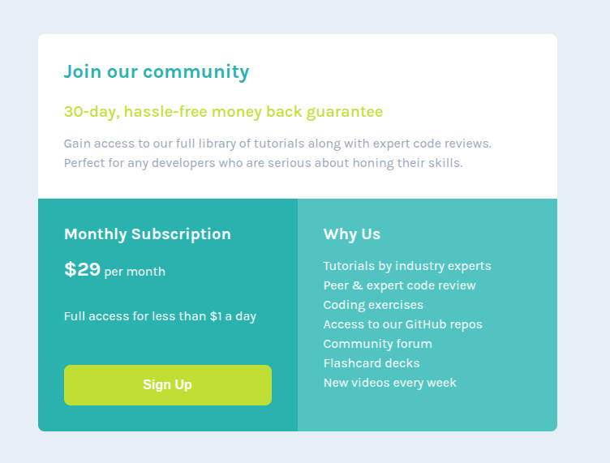

# Frontend Mentor - Single price grid component solution

This is a solution to the [Single price grid component challenge on Frontend Mentor](https://www.frontendmentor.io/challenges/single-price-grid-component-5ce41129d0ff452fec5abbbc). Frontend Mentor challenges help you improve your coding skills by building realistic projects. 

## Table of contents

- [Overview](#overview)
  - [The challenge](#the-challenge)
  - [Screenshot](#screenshot)
  - [Links](#links)
- [My process](#my-process)
  - [Built with](#built-with)
  - [What I learned](#what-i-learned)
  - [Continued development](#continued-development)
  - [AI Collaboration](#ai-collaboration)

## Overview

### The challenge

Users should be able to:

- View the optimal layout for the component depending on their device's screen size
- See a hover state on desktop for the Sign Up call-to-action

### Screenshot

### Links

- Solution URL: [Click Here](https://github.com/UnknownBuilder/FEmentor_price-grid)
- Live Site URL: [Click Here](https://unknownbuilder.github.io/FEmentor_price-grid)

## My process

### Built with

- Vanilla HTML5 & CSS
- Google Gemini
- Antigravity CLI

### What I learned

I didn't learn anything new. I'm pretty sure that I'm past the newbie phase and should start doing more Junior and maybe even intermediate challenges. 

### Continued development

I'm 5 project away from completing all the free Newbie challenges that I'm going to make a point of finishing the rest of them before I start the Junior challenges. I have some vacation time coming my way I feel I can knock the last of them out in a day or two. 

For the Junior challenges, I'm going to start using some technologies like Tailwind, Svelte, Typescript and others. I've been eyeing using these technologies and have even started watching tutorials on how they work so I'm eager to move to the next level of Front End Mentor. 

I think I'm going to try and read up on Ai and how to use it as a tutor using the Front End Mentor AGENT.md framework. I really did save a lot of time searching for answers with Ai so I want to continue to leverage this. 

### AI Collaboration

The new Ai prompts that are now included in the package had a me a bit confused so I deleted them. It's been a while since I finished one of these challenges. My job required a lot of time these past few months. What can you do.

I did use Googles Gemini to help me remember how to do a few things. Ai is a god send then you're tyring to learn something quickly. It use to take me a good 5 to 10 min to remind me how to so something but now, seconds. 

I used Antigravity CLI to ask it about how I could improve my code and it did provide some recommendations that I wouldn't have thought to implement so it tought me a few things here and there. It found some honest errors on my part like unused css due to some refactoring so that was cool. I'm curious if I would have kept the AGENTS.md file how the Ai would have responded to my prompt of helping me improve the code I had written. Next time.
